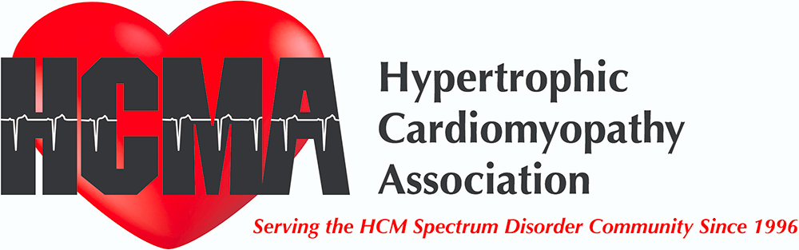

## Mission

Providing support, advocacy, and education to patients, families, the medical community, and the public about hypertrophic cardiomyopathy, while supporting research and fostering the development of treatments.

## Vision

To be the pre-eminent organization improving the lives of those with HCM, preventing untimely deaths, and advancing global understanding.

## Objectives
<ul>
<li>Educate about the symptoms and treatment options for patients, their families and their medical providers.</li>

<li>Advocate for policy/ legislation that improves disease detection, healthcare access, matters of importance to the community.</li>

<li>Develop and maintain a network of support for individuals with HCM and their families.</li>

<li>Increase accessibility to specialized healthcare professionals providing evidence-based treatment of HCM.</li>

<li>Promote and publish research of HCM and broaden access to results with the ultimate goal of eradicating the disease.</li>

<li>Partner with complementary organizations that will help further the mission of the education about, and management of the disease.</li>

<li>Generate appropriate funding for a sustainable organization and ongoing patient and physician engagement.</li>
</ul>
The HCMA was founded in 1996 as a 501c3 nonprofit organization. We provide support, advocacy, and education to patients, families, the medical community, and the public about hypertrophic cardiomyopathy while supporting research and fostering the development of treatments.
  
We support the creation of high volume Center of Excellence care models to ensure all needs of the HCM patient community are met at the highest possible level. We believe in improving global awareness of the risks of this genetic heart disease and ensuring disease understanding, its complete natural history, and treatments are improved until the ultimate eradication of the disease itself.
